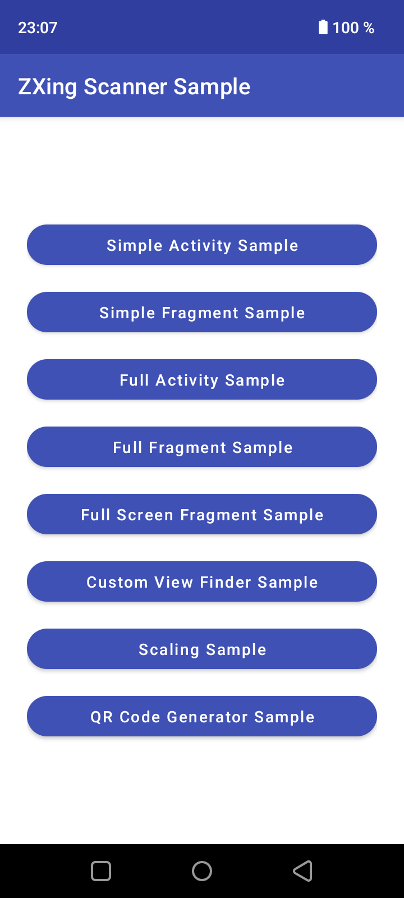
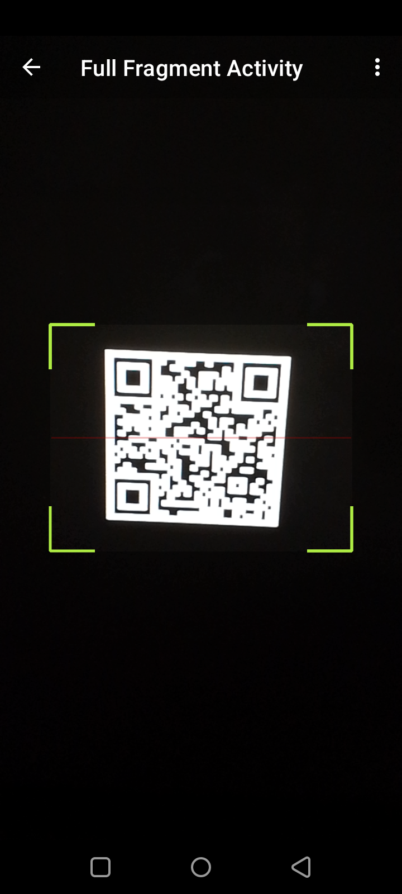
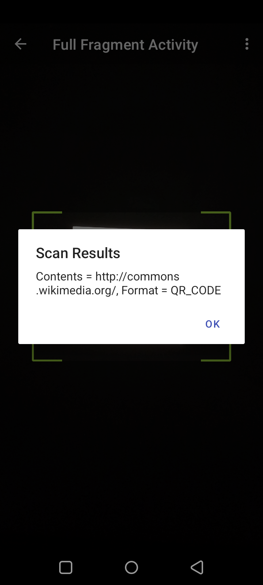

# QR / Barcode Scanner Android

> This repository is a maintained fork of the original [dm77/barcodescanner](https://github.com/dm77/barcodescanner) project.

The original project was archived on July 1, 2020 and is no longer maintained by its original author. This fork keeps the library available and usable with newer Android tooling, dependencies, and build environments.

All original credits, copyright notices, and license terms are preserved. This fork remains based on the original `dm77/barcodescanner` project and continues to follow the Apache License 2.0 terms that apply to the original code.

## Maintenance status

This fork is maintained primarily for my own Android projects, but the repository is public so others may clone it, inspect it, or use it under the terms of the original license.

## Original project status

The original `dm77/barcodescanner` project was archived on July 1, 2020 and is no longer maintained by its original author.

<details>
<summary>Original archive notice</summary>

**July 1, 2020**

This project is no longer maintained. When I first started this project in late 2013 there were very few libraries to help with barcode scanning on Android. But the situation today is much different. We have lots of great libraries based on ZXing and there is also barcode scanning API in Google's MLKit (https://github.com/googlesamples/mlkit). So given the options I have decided to stop working on this project.

</details>

Introduction
============

Android library projects that provides easy to use and extensible Barcode Scanner views based on ZXing and ZBar.

Screenshots
===========




Minor BREAKING CHANGE in 1.8.4
==============================
Version 1.8.4 introduces a couple of new changes:

* Open Camera and handle preview frames in a separate HandlerThread (#1, #99): Though this has worked fine in my testing on 3 devices, I would advise you to test on your own devices before blindly releasing apps with this version. If you run into any issues please file a bug report.
* Do not automatically stopCamera after a result is found #115: This means that upon a successful scan only the cameraPreview is stopped but the camera is not released. So previously if your code was calling mScannerView.startCamera() in the handleResult() method, please replace that with a call to mScannerView.resumeCameraPreview(this);

ZXing
=====

Installation
------------

This fork is maintained as a local Android library project.  
The original JCenter/Bintray dependency flow is no longer used.  

To use the ZXing scanner implementation, include the required local modules in your app project.  

In your `settings.gradle.kts`:  

```kotlin
include(":core")
project(":core").projectDir = file("../qr-barcode-scanner-android/core")
include(":zxing")
project(":zxing").projectDir = file("../qr-barcode-scanner-android/zxing")
```

> The paths used in `projectDir` must point to the location where you downloaded or cloned this library project.  
> For example, `../qr-barcode-scanner-android/core` assumes that your app project and `qr-barcode-scanner-android` are sibling folders.  
> If your folder structure is different, update the path accordingly.  

Then add the ZXing module dependency in the module where you want to use the scanner:  

```kotlin
dependencies {
    implementation(project(":zxing"))
}
```

The `:zxing` module depends on `:core`, so you normally do not need to add `:core` directly as a dependency.  

Depending on your project setup, you may also need to declare dependencies used by the local library modules in your own version catalog, for example:  

```toml
[versions]
androidxAnnotation = "1.9.1"
zxing = "3.5.4"

[libraries]
androidx-annotation = { group = "androidx.annotation", name = "annotation", version.ref = "androidxAnnotation" }
zxing-core = { group = "com.google.zxing", name = "core", version.ref = "zxing" }
```

The core module declares the camera permission and required camera feature in its manifest. Apps still need to request the camera permission at runtime before starting the scanner.  

Simple Usage
------------

1.) Add camera permission to your AndroidManifest.xml file:

```xml
<uses-permission android:name="android.permission.CAMERA" />
```

2.) A very basic activity would look like this:

```kotlin
import android.app.Activity
import android.os.Bundle
import android.util.Log
import com.google.zxing.Result
import me.dm7.barcodescanner.zxing.ResultHandler
import me.dm7.barcodescanner.zxing.ZXingScannerView

private const val TAG = "SimpleScannerActivity"

class SimpleScannerActivity : Activity(), ResultHandler {

    private var scannerView: ZXingScannerView? = null

    override fun onCreate(state: Bundle?) {
        super.onCreate(state)
        val newScannerView = ZXingScannerView(this) // Programmatically initialize the scanner view
        scannerView = newScannerView
        setContentView(newScannerView) // Set the scanner view as the content view
    }

    override fun onResume() {
        super.onResume()
        scannerView?.setResultHandler(this) // Register ourselves as a handler for scan results.
        scannerView?.startCamera() // Start camera on resume
    }

    override fun onPause() {
        super.onPause()
        scannerView?.stopCamera() // Stop camera on pause
    }

    override fun handleResult(rawResult: Result) {
        // Do something with the result here
        Log.v(TAG, rawResult.text) // Prints scan results
        Log.v(TAG, rawResult.barcodeFormat.toString()) // Prints the scan format (qrcode, pdf417 etc.)

        // If you would like to resume scanning, call this method below:
        scannerView?.resumeCameraPreview(this)
    }
}
```

Please take a look at the [zxing-sample](https://github.com/dm77/barcodescanner/tree/master/zxing-sample) project for a full working example.

Advanced Usage
--------------

Take a look at the [FullScannerActivity.kt](https://github.com/dm77/barcodescanner/blob/master/zxing-sample/src/main/java/me/dm7/barcodescanner/zxing/sample/FullScannerActivity.java) or [FullScannerFragment.kt](https://github.com/dm77/barcodescanner/blob/master/zxing-sample/src/main/java/me/dm7/barcodescanner/zxing/sample/FullScannerFragment.java) classes to get an idea on advanced usage.

Interesting methods on the ZXingScannerView include:

```kotlin
// Toggle flash:
fun setFlash(flag: Boolean)

// Toggle autofocus:
fun setAutoFocus(state: Boolean)

// Specify interested barcode formats:
fun setFormats(formats: List<BarcodeFormat>)

// Specify the cameraId to start with:
fun startCamera(cameraId: Int)
```

Specify front-facing or rear-facing cameras by using the `fun startCamera(cameraId: Int)` method.


For HUAWEI mobile phone like P9, P10, when scanning using the default settings, it won't work due to the
"preview size",  please adjust the parameter as below:

```kotlin
scannerView = findViewById(R.id.zx_view)

// This parameter helps improve camera preview behavior on some HUAWEI devices.
scannerView?.setAspectTolerance(0.5f)
```

Supported Formats:

```kotlin
BarcodeFormat.UPC_A
BarcodeFormat.UPC_E
BarcodeFormat.EAN_13
BarcodeFormat.EAN_8
BarcodeFormat.RSS_14
BarcodeFormat.CODE_39
BarcodeFormat.CODE_93
BarcodeFormat.CODE_128
BarcodeFormat.ITF
BarcodeFormat.CODABAR
BarcodeFormat.QR_CODE
BarcodeFormat.DATA_MATRIX
BarcodeFormat.PDF_417
```

ZBar
====

Installation
------------

This fork is maintained as a local Android library project.  
The original JCenter/Bintray dependency flow is no longer used.  

To use the ZBar scanner implementation, include the required local modules in your app project.  

In your `settings.gradle.kts`:  

```kotlin
include(":core")
project(":core").projectDir = file("../qr-barcode-scanner-android/core")
include(":zbar")
project(":zbar").projectDir = file("../qr-barcode-scanner-android/zbar")
```

> The paths used in `projectDir` must point to the location where you downloaded or cloned this library project.  
> For example, `../qr-barcode-scanner-android/core` assumes that your app project and `qr-barcode-scanner-android` are sibling folders.  
> If your folder structure is different, update the path accordingly.  

Then add the ZBar module dependency in the module where you want to use the scanner:  

```kotlin
dependencies {
    implementation(project(":zbar"))
}
```

The `:zbar` module depends on `:core`, so you normally do not need to add `:core` directly as a dependency.  

Depending on your project setup, you may also need to declare dependencies used by the local library modules in your own version catalog, for example:  

```toml
[versions]
androidxAnnotation = "1.9.1"

[libraries]
androidx-annotation = { group = "androidx.annotation", name = "annotation", version.ref = "androidxAnnotation" }
```

The core module declares the camera permission and required camera feature in its manifest. Apps still need to request the camera permission at runtime before starting the scanner.  

Simple Usage
------------

1.) Add camera permission to your AndroidManifest.xml file:

```xml
<uses-permission android:name="android.permission.CAMERA" />
```

2.) A very basic activity would look like this:

```kotlin
import android.app.Activity
import android.os.Bundle
import android.util.Log
import me.dm7.barcodescanner.zbar.Result
import me.dm7.barcodescanner.zbar.ResultHandler
import me.dm7.barcodescanner.zbar.ZBarScannerView

private const val TAG = "SimpleScannerActivity"

class SimpleScannerActivity : Activity(), ResultHandler {

    private var scannerView: ZBarScannerView? = null

    override fun onCreate(state: Bundle?) {
        super.onCreate(state)

        val newScannerView = ZBarScannerView(this) // Programmatically initialize the scanner view
        scannerView = newScannerView
        setContentView(newScannerView) // Set the scanner view as the content view
    }

    override fun onResume() {
        super.onResume()

        scannerView?.setResultHandler(this) // Register ourselves as a handler for scan results.
        scannerView?.startCamera() // Start camera on resume
    }

    override fun onPause() {
        super.onPause()

        scannerView?.stopCamera() // Stop camera on pause
    }

    override fun handleResult(rawResult: Result) {
        // Do something with the result here
        Log.v(TAG, rawResult.contents.orEmpty()) // Prints scan results
        Log.v(TAG, rawResult.barcodeFormat?.name.orEmpty()) // Prints the scan format

        // If you would like to resume scanning, call this method below:
        scannerView?.resumeCameraPreview(this)
    }
}
```

Please take a look at the [zbar-sample](https://github.com/dm77/barcodescanner/tree/master/zbar-sample)  project for a full working example.

Advanced Usage
--------------


Take a look at the [FullScannerActivity.kt](https://github.com/dm77/barcodescanner/blob/master/zbar-sample/src/main/java/me/dm7/barcodescanner/zbar/sample/FullScannerActivity.java) or [FullScannerFragment.kt](https://github.com/dm77/barcodescanner/blob/master/zbar-sample/src/main/java/me/dm7/barcodescanner/zbar/sample/FullScannerFragment.java) classes to get an idea on advanced usage.

Interesting methods on the ZBarScannerView include:

```kotlin
// Toggle flash:
fun setFlash(flag: Boolean)

// Toggle autofocus:
fun setAutoFocus(state: Boolean)

// Specify interested barcode formats:
fun setFormats(formats: List<BarcodeFormat>)
```

Specify front-facing or rear-facing cameras by using the `fun startCamera(cameraId: Int)` method.

Supported Formats:

```kotlin
BarcodeFormat.PARTIAL
BarcodeFormat.EAN8
BarcodeFormat.UPCE
BarcodeFormat.ISBN10
BarcodeFormat.UPCA
BarcodeFormat.EAN13
BarcodeFormat.ISBN13
BarcodeFormat.I25
BarcodeFormat.DATABAR
BarcodeFormat.DATABAR_EXP
BarcodeFormat.CODABAR
BarcodeFormat.CODE39
BarcodeFormat.PDF417
BarcodeFormat.QR_CODE
BarcodeFormat.CODE93
BarcodeFormat.CODE128
```

Rebuilding ZBar Libraries
=========================

```
mkdir some_work_dir
cd work_dir
wget http://ftp.gnu.org/pub/gnu/libiconv/libiconv-1.14.tar.gz
tar zxvf libiconv-1.14.tar.gz
```

Patch the localcharset.c file:
vim libiconv-1.14/libcharset/lib/localcharset.c

On line 48, add the following line of code:

```
#undef HAVE_LANGINFO_CODESET
```

Save the file and continue with steps below:
```
cd libiconv-1.14
./configure
cd ..
hg clone http://hg.code.sf.net/p/zbar/code zbar-code
cd zbar-code/android
android update project -p . -t 'android-19'
```

Open jni/Android.mk file and add fPIC flag to LOCAL_C_FLAGS.
Open jni/Application.mk file and specify APP_ABI targets as needed.

```
ant -Dndk.dir=$NDK_HOME  -Diconv.src=some_work_dir/libiconv-1.14 zbar-clean zbar-all
```

Upon completion you can grab the .so and .jar files from the libs folder.

Credits
=======

Almost all of the code for these library projects is based on:

1. CameraPreview app from Android SDK APIDemos
2. The ZXing project: https://github.com/zxing/zxing
3. The ZBar Android SDK: https://github.com/ZBar/ZBar/tree/master/android (Previously: http://sourceforge.net/projects/zbar/files/AndroidSDK/)

Contributors
============

https://github.com/dm77/barcodescanner/graphs/contributors

License
=======
License for code written in this project is: Apache License, Version 2.0

License for zxing and zbar projects is here:
* https://github.com/zxing/zxing/blob/master/LICENSE
* https://github.com/ZBar/ZBar/tree/master/android
